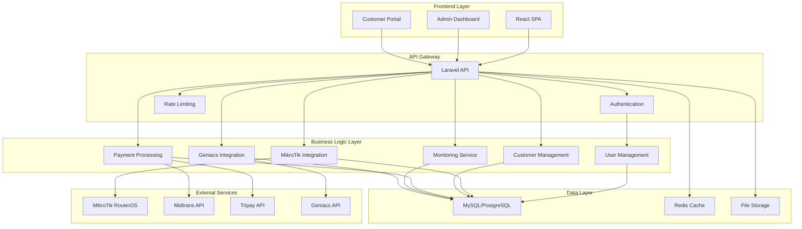
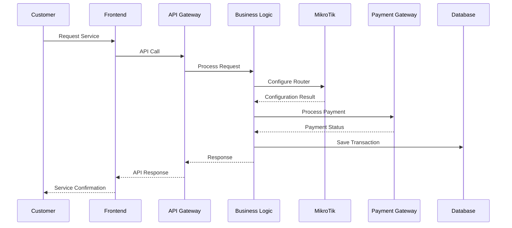

# System Architecture Overview

## High-Level Architecture



## Core Components

### 1. Authentication & Authorization
- **Laravel Sanctum** untuk API authentication
- Role-based access control (RBAC)
- JWT tokens untuk stateless authentication
- Rate limiting untuk security

### 2. MikroTik Integration Service
- **RouterOS API v6 & v7** support
- Multi-NAS management
- Connection pooling untuk efisiensi
- Real-time synchronization
- Failover mechanism

### 3. Customer Management
- Customer registration & onboarding
- Service plans management
- Customer mapping dengan network topology
- Subscription management
- Billing cycle management

### 4. Monitoring Service
- Real-time network monitoring
- Bandwidth usage tracking
- Connection status monitoring
- Alert system
- Historical data analysis

### 5. Payment Gateway
- **Midtrans & Tripay** integration
- Multiple payment methods
- Transaction status tracking
- Automated billing
- Invoice generation

### 6. Geniacs Integration
- API synchronization
- Data mapping
- Real-time updates
- Error handling & retry mechanism

## Data Flow Architecture



## Scalability Considerations

### 1. Horizontal Scaling
- Stateless API design
- Load balancer ready
- Database read replicas
- Redis clustering

### 2. Performance Optimization
- Database indexing strategy
- Caching layers
- Queue system for background jobs
- CDN for static assets

### 3. High Availability
- Database failover
- Redis sentinel
- Circuit breaker pattern untuk external APIs
- Graceful degradation

## Security Architecture

### 1. Network Security
- HTTPS enforcement
- API rate limiting
- IP whitelisting untuk admin access
- Firewall rules

### 2. Data Security
- Encryption at rest
- Encrypted communication dengan external APIs
- Sensitive data masking
- Audit logging

### 3. Application Security
- Input validation & sanitization
- SQL injection prevention
- XSS protection
- CSRF protection
- Secure headers

## Technology Details

### Backend Stack
- **Laravel 10+**: PHP framework
- **PHP 8.1+**: Backend language
- **MySQL 8.0+ / PostgreSQL 13+**: Primary database
- **Redis 6+**: Caching & queue
- **Elasticsearch (optional)**: Advanced logging & analytics

### Frontend Stack
- **React 18+**: UI framework
- **Vite**: Build tool
- **Tailwind CSS**: Styling
- **React Query**: State management & caching
- **React Router**: Client-side routing

### DevOps & Infrastructure
- **Docker**: Containerization
- **Nginx**: Reverse proxy & static files
- **Supervisor**: Process management
- **Laravel Horizon**: Queue monitoring
- **Laravel Telescope**: Debugging & monitoring

## Integration Patterns

### 1. API Integration Pattern
```php
// Abstract base class untuk external API integration
abstract class ExternalApiService
{
    protected function makeRequest(string $method, string $endpoint, array $data = [])
    {
        // Rate limiting, retry logic, error handling
    }
    
    protected function handleResponse(Response $response)
    {
        // Standardized response handling
    }
}
```

### 2. Event-Driven Architecture
```php
// Event untuk MikroTik synchronization
class MikroTikConfigurationChanged
{
    public function __construct(
        public Router $router,
        public array $changes
    ) {}
}

// Listener untuk update database
class UpdateDatabaseAfterMikroTikChange
{
    public function handle(MikroTikConfigurationChanged $event)
    {
        // Sync database dengan MikroTik changes
    }
}
```

### 3. Queue-Based Processing
```php
// Job untuk background processing
class ProcessCustomerSubscription
{
    public function __construct(
        public Customer $customer,
        public ServicePlan $plan
    ) {}
    
    public function handle()
    {
        // Configure MikroTik
        // Process payment
        // Send notifications
    }
}
```

## Monitoring & Observability

### 1. Application Monitoring
- Laravel Telescope untuk development
- Laravel Horizon untuk queue monitoring
- Custom health checks
- Performance metrics

### 2. Infrastructure Monitoring
- Server resource monitoring
- Database performance
- Redis metrics
- Network latency tracking

### 3. Business Metrics
- Customer acquisition rate
- Revenue tracking
- Service uptime
- Payment success rate