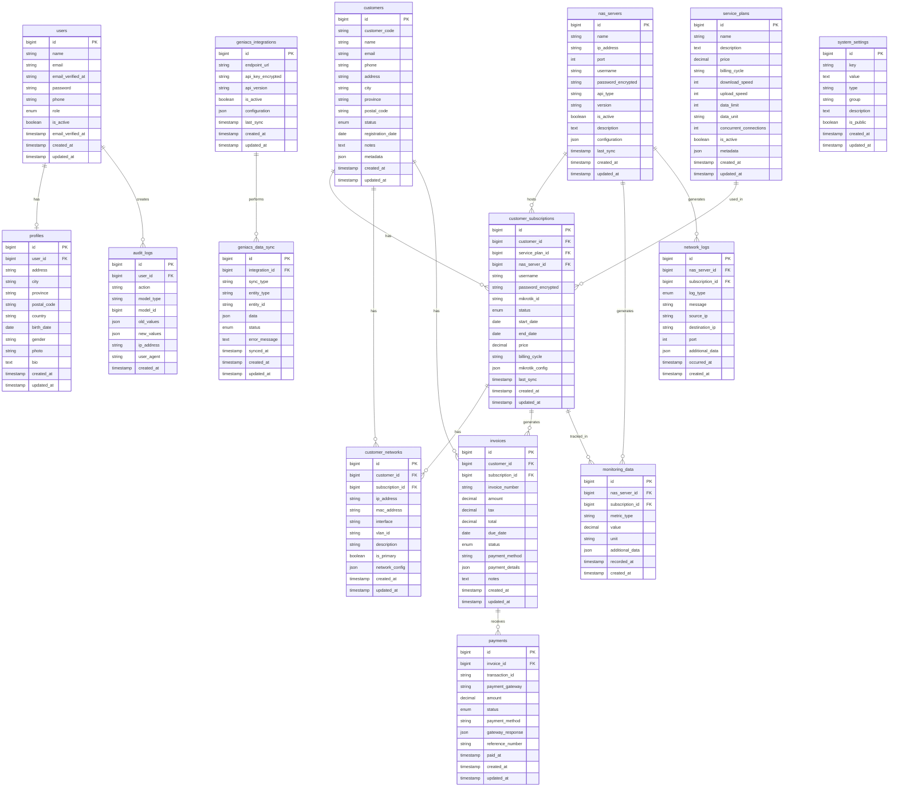

# Database Schema Design

## Entity Relationship Diagram (ERD)



## Table Descriptions

### 1. Authentication & User Management

#### `users`
- **Purpose**: Core user authentication and authorization
- **Key Fields**: 
  - `role`: admin, staff, customer
  - `is_active`: account status
- **Indexes**: email, role, is_active

#### `profiles`
- **Purpose**: Extended user information
- **Relationship**: One-to-one with users
- **Key Fields**: address, photo, bio

### 2. Network Infrastructure

#### `nas_servers`
- **Purpose**: Multi MikroTik RouterOS management
- **Key Fields**:
  - `api_type`: routeros_v6, routeros_v7
  - `configuration`: encrypted connection details
  - `last_sync`: synchronization timestamp
- **Indexes**: ip_address, is_active

#### `service_plans`
- **Purpose**: Internet service plan definitions
- **Key Fields**:
  - `billing_cycle`: monthly, yearly, custom
  - `data_unit`: GB, MB, unlimited
- **Indexes**: is_active, price

### 3. Customer Management

#### `customers`
- **Purpose**: Customer master data
- **Key Fields**:
  - `customer_code`: unique customer identifier
  - `status`: active, suspended, terminated
- **Indexes**: customer_code, email, status

#### `customer_subscriptions`
- **Purpose**: Active customer service subscriptions
- **Key Fields**:
  - `mikrotik_id`: RouterOS user identifier
  - `status`: active, expired, suspended
  - `mikrotik_config`: RouterOS specific settings
- **Indexes**: customer_id, nas_server_id, mikrotik_id, status

#### `customer_networks`
- **Purpose**: Customer network configuration
- **Key Fields**:
  - `ip_address`: assigned IP
  - `mac_address`: device MAC
  - `is_primary`: primary connection
- **Indexes**: ip_address, mac_address, subscription_id

### 4. Billing & Payments

#### `invoices`
- **Purpose**: Customer billing records
- **Key Fields**:
  - `invoice_number`: unique invoice identifier
  - `status`: draft, sent, paid, overdue, cancelled
  - `payment_method`: midtrans, tripay, manual
- **Indexes**: invoice_number, customer_id, status, due_date

#### `payments`
- **Purpose**: Payment transaction records
- **Key Fields**:
  - `transaction_id`: gateway transaction ID
  - `payment_gateway`: midtrans, tripay
  - `gateway_response`: full gateway response
- **Indexes**: transaction_id, invoice_id, payment_gateway, status

### 5. Monitoring & Logging

#### `monitoring_data`
- **Purpose**: Real-time monitoring metrics
- **Key Fields**:
  - `metric_type`: bandwidth, connection_count, cpu_usage
  - `value`: metric value
  - `unit`: Mbps, count, percentage
- **Indexes**: nas_server_id, subscription_id, metric_type, recorded_at

#### `network_logs`
- **Purpose**: Network activity logging
- **Key Fields**:
  - `log_type`: authentication, connection, error, system
  - `source_ip`, `destination_ip`: network endpoints
- **Indexes**: nas_server_id, subscription_id, log_type, occurred_at

### 6. Geniacs Integration

#### `geniacs_integrations`
- **Purpose**: Geniacs API integration configuration
- **Key Fields**:
  - `api_key_encrypted`: encrypted API credentials
  - `configuration`: integration settings
- **Indexes**: is_active

#### `geniacs_data_sync`
- **Purpose**: Synchronization tracking
- **Key Fields**:
  - `sync_type`: full, incremental, real-time
  - `entity_type`: customer, subscription, payment
  - `status`: pending, success, failed
- **Indexes**: integration_id, sync_type, entity_type, status

### 7. System Management

#### `system_settings`
- **Purpose**: System configuration parameters
- **Key Fields**:
  - `key`: setting identifier
  - `type`: string, number, boolean, json
  - `is_public`: accessible via API
- **Indexes**: key, group

#### `audit_logs`
- **Purpose**: System activity auditing
- **Key Fields**:
  - `action`: create, update, delete, login
  - `model_type`, `model_id`: affected entity
  - `old_values`, `new_values`: change tracking
- **Indexes**: user_id, action, model_type, created_at

## Database Optimization Strategies

### 1. Indexing Strategy
- Primary keys on all tables
- Foreign key indexes for join performance
- Composite indexes for frequent query patterns
- Partial indexes for filtered queries

### 2. Partitioning
- `monitoring_data` by month for time-series data
- `network_logs` by month for log rotation
- `audit_logs` by quarter for archival

### 3. Data Archival
- Archive old monitoring data after 1 year
- Archive network logs after 6 months
- Archive audit logs after 2 years

### 4. Caching Strategy
- Redis for session management
- Redis for frequently accessed customer data
- Redis for monitoring data aggregation
- Application cache for system settings

## Migration Strategy

### Phase 1: Core Tables
```sql
-- User management
users, profiles, system_settings, audit_logs
```

### Phase 2: Network Infrastructure
```sql
-- NAS and service plans
nas_servers, service_plans
```

### Phase 3: Customer Management
```sql
-- Customer data
customers, customer_subscriptions, customer_networks
```

### Phase 4: Billing System
```sql
-- Financial data
invoices, payments
```

### Phase 5: Monitoring
```sql
-- Monitoring and logging
monitoring_data, network_logs
```

### Phase 6: Integrations
```sql
-- External integrations
geniacs_integrations, geniacs_data_sync
```

## Data Security Considerations

### 1. Encryption
- Password hashing with bcrypt
- API keys encrypted at rest
- Sensitive customer data encryption
- Database connection encryption

### 2. Access Control
- Row-level security for customer data
- Column-level encryption for sensitive fields
- Database user privilege separation
- API access token management

### 3. Backup & Recovery
- Daily automated backups
- Point-in-time recovery capability
- Geographic backup distribution
- Regular backup testing