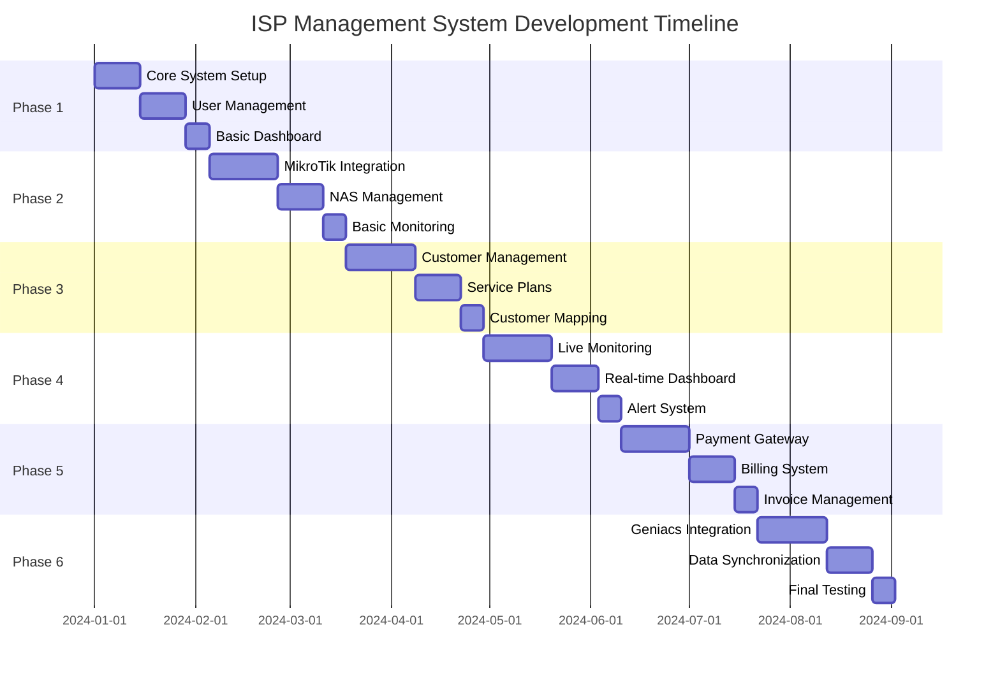

# ISP Management System Development Roadmap

## Overview

Roadmap ini dirancang untuk pengembangan bertahap di mana setiap fase dapat berdiri sendiri dan langsung memberikan nilai bisnis tanpa menunggu fase lain selesai.

## Development Phases



## Phase 1: Core System & User Management (3 weeks)

### Objective
Membangun fondasi sistem dengan manajemen pengguna yang lengkap dan dashboard dasar.

### Deliverables
- Laravel + React setup dengan authentication
- Role-based access control (Admin, Staff, Customer)
- User profile management
- Basic admin dashboard
- System settings management
- Audit logging system

### Key Features
1. **Authentication System**
   - Laravel Sanctum untuk API authentication
   - Multi-role authentication
   - Password reset functionality
   - Session management

2. **User Management**
   - User CRUD operations
   - Role assignment
   - Profile management
   - Activity logging

3. **Basic Dashboard**
   - System overview
   - User statistics
   - Recent activities
   - System health status

### Technical Requirements
- Laravel 10+ with PHP 8.1+
- React 18+ with Vite
- MySQL 8.0+ / PostgreSQL 13+
- Redis for caching
- Basic API documentation

### Database Tables
```sql
users, profiles, system_settings, audit_logs
```

### Success Criteria
- Users can register, login, and manage profiles
- Admin can manage users and roles
- Basic dashboard shows system overview
- Audit trail captures all user activities

---

## Phase 2: MikroTik Integration & NAS Management (6 weeks)

### Objective
Integrasi dengan MikroTik RouterOS v6 & v7 untuk manajemen multi-NAS.

### Deliverables
- ✅ MikroTik API integration service
- ✅ Multi-NAS server management
- ✅ RouterOS configuration synchronization
- ✅ Basic network monitoring
- ✅ Connection status tracking

### Key Features
1. **MikroTik Integration**
   - RouterOS API v6 & v7 support
   - Connection pooling dan retry mechanism
   - Real-time synchronization
   - Error handling & recovery

2. **NAS Management**
   - Add/edit/remove NAS servers
   - Connection status monitoring
   - Configuration backup & restore
   - Load balancing support

3. **Basic Monitoring**
   - Server availability check
   - Bandwidth usage tracking
   - Connection count monitoring
   - Basic alert system

### API Requirements
```php
// MikroTik API Service
interface MikroTikServiceInterface {
    public function connect(NasServer $nas): bool;
    public function getUsers(NasServer $nas): array;
    public function createUser(NasServer $nas, array $data): bool;
    public function updateUser(NasServer $nas, string $id, array $data): bool;
    public function deleteUser(NasServer $nas, string $id): bool;
    public function getTraffic(NasServer $nas): array;
}
```

### Database Tables
```sql
nas_servers, monitoring_data (basic), network_logs (basic)
```

### Success Criteria
- Can connect to multiple MikroTik servers
- Real-time synchronization of configurations
- Basic monitoring dashboard functional
- Automatic failover for disconnected NAS

---

## Phase 3: Customer Management & Mapping (6 weeks)

### Objective
Sistem manajemen pelanggan lengkap dengan pemetaan jaringan dan layanan.

### Deliverables
- ✅ Customer registration & management
- ✅ Service plan configuration
- ✅ Customer network mapping
- ✅ Subscription management
- ✅ Customer portal

### Key Features
1. **Customer Management**
   - Customer registration workflow
   - Customer data management
   - Document upload & verification
   - Customer categorization

2. **Service Plans**
   - Plan creation & management
   - Speed & bandwidth configuration
   - Pricing & billing cycle setup
   - Plan templates

3. **Network Mapping**
   - Geographic customer mapping
   - Network topology visualization
   - IP address management
   - Device configuration tracking

4. **Customer Portal**
   - Self-service portal
   - Service status viewing
   - Profile management
   - Support ticket system

### API Requirements
```php
// Customer Management
interface CustomerServiceInterface {
    public function createCustomer(array $data): Customer;
    public function updateCustomer(Customer $customer, array $data): Customer;
    public function deleteCustomer(Customer $customer): bool;
    public function getCustomerByCode(string $code): ?Customer;
    public function searchCustomers(array $filters): Collection;
}

// Subscription Management
interface SubscriptionServiceInterface {
    public function createSubscription(Customer $customer, ServicePlan $plan): Subscription;
    public function activateSubscription(Subscription $subscription): bool;
    public function suspendSubscription(Subscription $subscription): bool;
    public function terminateSubscription(Subscription $subscription): bool;
}
```

### Database Tables
```sql
customers, service_plans, customer_subscriptions, customer_networks
```

### Success Criteria
- Complete customer lifecycle management
- Service plan configuration working
- Network mapping visualization functional
- Customer portal fully operational

---

## Phase 4: Live Monitoring System (6 weeks)

### Objective
Sistem monitoring real-time dengan dashboard interaktif dan alert system.

### Deliverables
- ✅ Real-time monitoring dashboard
- ✅ Bandwidth usage analytics
- ✅ Connection quality monitoring
- ✅ Alert & notification system
- ✅ Historical data analysis

### Key Features
1. **Real-time Monitoring**
   - Live bandwidth usage
   - Connection status monitoring
   - Server performance metrics
   - Network latency tracking

2. **Analytics Dashboard**
   - Traffic usage trends
   - Peak hour analysis
   - Customer usage patterns
   - Network performance reports

3. **Alert System**
   - Threshold-based alerts
   - Email & SMS notifications
   - Alert escalation rules
   - Alert history & analytics

4. **Historical Data**
   - Long-term data retention
   - Trend analysis
   - Performance reporting
   - Data export functionality

### API Requirements
```php
// Monitoring Service
interface MonitoringServiceInterface {
    public function getRealTimeData(NasServer $nas): array;
    public function getBandwidthUsage(Subscription $subscription, Carbon $from, Carbon $to): array;
    public function getConnectionStats(NasServer $nas, Carbon $from, Carbon $to): array;
    public function generateReport(string $type, array $parameters): array;
}

// Alert Service
interface AlertServiceInterface {
    public function createAlert(array $data): Alert;
    public function checkThresholds(): void;
    public function sendNotification(Alert $alert): bool;
    public function escalateAlert(Alert $alert): bool;
}
```

### Database Tables
```sql
monitoring_data (extended), network_logs (extended), alerts, alert_rules, notifications
```

### Success Criteria
- Real-time monitoring dashboard functional
- Alert system working with notifications
- Historical data analysis available
- Performance reports generated automatically

---

## Phase 5: Payment Gateway Integration (6 weeks)

### Objective
Integrasi payment gateway (Midtrans & Tripay) dengan sistem billing otomatis.

### Deliverables
- ✅ Midtrans & Tripay integration
- ✅ Automated billing system
- ✅ Invoice generation & management
- ✅ Payment processing & reconciliation
- ✅ Financial reporting

### Key Features
1. **Payment Gateway Integration**
   - Midtrans API integration
   - Tripay API integration
   - Multiple payment methods
   - Transaction status tracking

2. **Billing System**
   - Automated invoice generation
   - Recurring billing
   - Payment reminders
   - Late fee calculation

3. **Invoice Management**
   - Invoice creation & sending
   - Invoice templates
   - Payment status tracking
   - Invoice history

4. **Financial Reporting**
   - Revenue reports
   - Payment analytics
   - Customer billing history
   - Tax reporting

### API Requirements
```php
// Payment Gateway Service
interface PaymentGatewayServiceInterface {
    public function createPayment(Invoice $invoice, string $gateway): PaymentResponse;
    public function checkPaymentStatus(string $transactionId, string $gateway): PaymentStatus;
    public function processCallback(array $data, string $gateway): bool;
    public function refundPayment(Payment $payment, float $amount): RefundResponse;
}

// Billing Service
interface BillingServiceInterface {
    public function generateInvoice(Subscription $subscription): Invoice;
    public function processRecurringBilling(): void;
    public function calculateLateFees(Invoice $invoice): float;
    public function sendPaymentReminder(Invoice $invoice): bool;
}
```

### Database Tables
```sql
invoices, payments, payment_gateways, billing_cycles, late_fees
```

### Success Criteria
- Payment gateways fully integrated
- Automated billing system working
- Invoice generation functional
- Financial reports accurate

---

## Phase 6: Geniacs Integration (6 weeks)

### Objective
Integrasi dengan Geniacs untuk sinkronisasi data dan operasional.

### Deliverables
- ✅ Geniacs API integration
- ✅ Data synchronization system
- ✅ Real-time sync capabilities
- ✅ Error handling & recovery
- ✅ Integration monitoring

### Key Features
1. **Geniacs Integration**
   - API connection management
   - Authentication & authorization
   - Data mapping configuration
   - Sync scheduling

2. **Data Synchronization**
   - Customer data sync
   - Subscription sync
   - Payment data sync
   - Bi-directional sync support

3. **Real-time Sync**
   - Event-driven synchronization
   - Webhook handling
   - Conflict resolution
   - Sync status tracking

4. **Monitoring & Recovery**
   - Sync monitoring dashboard
   - Error logging & alerting
   - Automatic retry mechanism
   - Manual sync capabilities

### API Requirements
```php
// Geniacs Integration Service
interface GeniacsServiceInterface {
    public function connect(): bool;
    public function syncCustomers(): SyncResult;
    public function syncSubscriptions(): SyncResult;
    public function syncPayments(): SyncResult;
    public function handleWebhook(array $data): bool;
}

// Sync Manager
interface SyncManagerInterface {
    public function scheduleSync(string $entityType, Carbon $schedule): void;
    public function executeSync(string $entityType): SyncResult;
    public function resolveConflict(SyncConflict $conflict): bool;
    public function getSyncStatus(string $entityType): SyncStatus;
}
```

### Database Tables
```sql
geniacs_integrations, geniacs_data_sync, sync_conflicts, sync_logs
```

### Success Criteria
- Geniacs API fully integrated
- Data synchronization working
- Real-time sync functional
- Error recovery mechanisms in place

---

## Implementation Strategy

### 1. Development Approach
- **Agile methodology** dengan 2-week sprints
- **Feature branching** untuk setiap modul
- **Continuous integration** dengan automated testing
- **Code review** process untuk quality assurance

### 2. Testing Strategy
- **Unit testing** untuk business logic
- **Integration testing** untuk API endpoints
- **End-to-end testing** untuk user workflows
- **Performance testing** untuk critical components

### 3. Deployment Strategy
- **Staging environment** untuk testing
- **Blue-green deployment** untuk production
- **Rollback capability** untuk emergency
- **Monitoring & alerting** untuk production health

### 4. Risk Mitigation
- **Technical debt management** dengan regular refactoring
- **Security audits** untuk compliance
- **Backup & recovery** procedures
- **Documentation maintenance** throughout development

## Success Metrics

### Phase 1 Success Metrics
- User registration completion rate > 95%
- Login success rate > 99%
- Dashboard load time < 2 seconds

### Phase 2 Success Metrics
- NAS connection success rate > 98%
- Sync latency < 5 seconds
- Monitoring data accuracy > 99%

### Phase 3 Success Metrics
- Customer onboarding time < 10 minutes
- Service plan activation time < 2 minutes
- Customer portal uptime > 99.5%

### Phase 4 Success Metrics
- Real-time monitoring latency < 1 second
- Alert response time < 5 minutes
- Report generation time < 30 seconds

### Phase 5 Success Metrics
- Payment success rate > 95%
- Invoice generation accuracy > 99%
- Billing cycle completion rate > 98%

### Phase 6 Success Metrics
- Data sync accuracy > 99.5%
- Sync completion time < 10 minutes
- Error recovery time < 5 minutes

## Resource Requirements

### Development Team
- **Backend Developer**: 2-3 developers
- **Frontend Developer**: 1-2 developers
- **DevOps Engineer**: 1 engineer
- **QA Engineer**: 1 engineer
- **Project Manager**: 1 manager

### Infrastructure
- **Development Environment**: Cloud-based development servers
- **Staging Environment**: Production-like staging setup
- **Production Environment**: High-availability production setup
- **Monitoring**: Comprehensive monitoring & alerting system

### Timeline
- **Total Duration**: 33 weeks (approximately 8 months)
- **Buffer Time**: 2 weeks included per phase
- **Go-live**: End of Phase 6 with all systems operational